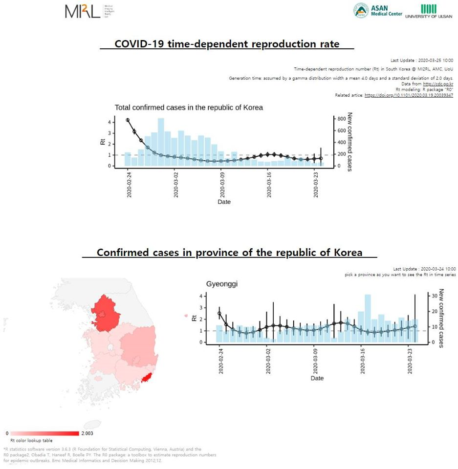
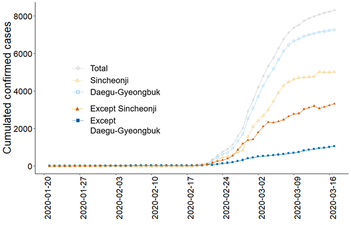
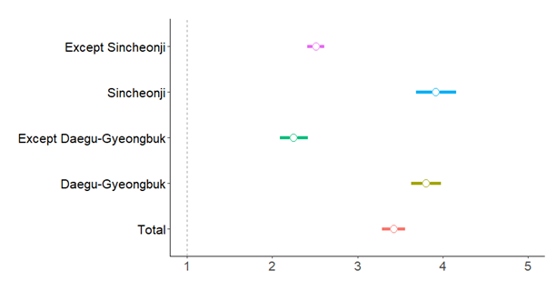
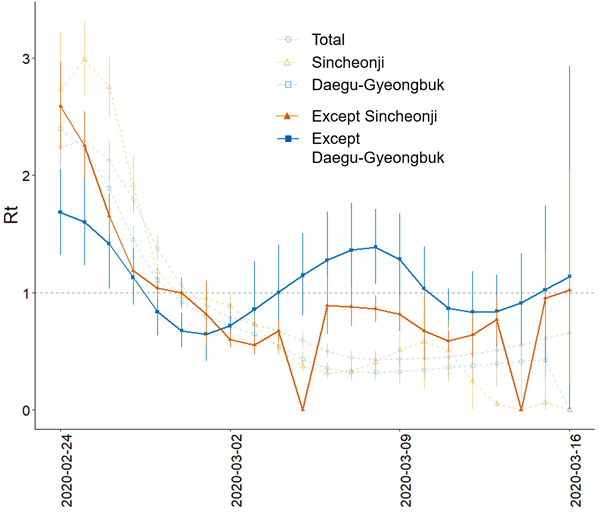

    

    

### Title: Basic and effective reproduction number of COVID-19 in South Korea without Sincheonji cases

medRxiv https://www.medrxiv.org/content/10.1101/2020.03.19.20039347v1

Automated updated web page : http://covid19.mi2rl.co/

<b>Abstract</b>

Recently (2019-03-19), the number of confirmed patients of COVID-19 in South Korea are decreasing. However, super cluster caused by Sincheonji-cult mass infection incidence in Daegu area, makes it difficult to evaluate that the current policy for infection prevision with social distancing, closing school, hand washing, and wearing mask is good enough or not. Therefore, in this study, we evaluated basic reproduction number R0 and time-dependent reproduction number Rt of confirmed patients based on various kinds of populations including total, Daegu-Geyoengbuk, except-Daegu-Gyeongbuk, Sincheonji, and except-Sincheonji, which leads to conclusion that in total, it seems the disease is going to be under control, but it is never true, because if we analyze except-Sincheonji and except-Daegu-Geyongbuk cases, the basic reproduction rate is still above 1.0, and the effective reproduction rate Rt is still higher than 1.0. In addition, we deployed this method in the home page(http://covid19.mi2rl.co/) to identify realtime update of each local province. This could be used for determining the government policy in near future. 

### Text

South Korea have currently 8,413 cumulated confirmed COVID-19 cases. There was a large ‘black swan’ event called Sincheonji-cult mass infection incidence, that leads an exponential increase of the confirmed cases. A great effort was made to defend the public from the disease since, and in some extent, it suppressed the spread. The basic and time-dependent effective reproduction number R0 and Rt are two of the most representative characteristics for the dynamics of the infectious disease. To observe the basic features of the COVID-19 outbreak in South Korea without the black-swan effect, we collected the daily counts of confirmed cases. The Korean Centers for Disease Control and Prevention (KCDC) has investigated, summarized and released the daily updates for the cumulated counts of the confirmed cases, which are available on-line [http://cdc.go.kr]. The cumulated counts have been provided in total, according to the administrative provinces (Gwangyeok-Si and Do in the South  Korean administrative system), and several mass infection cases. We collected counts of the daily confirmed case of Sincheonji-cult that named after a church with COVID-19 outbreak and subtracted them from the total counts to comprise the ‘except Sincheonji’ cases. Additionally, we collected the counts of Daegu-si and Gyeongsangbuk-do province which surrounds Daegu-si, because the initial outbreak of Sincheonji-cult took place in those areas. We summed up the counts of the two provinces and subtracted them from the total counts to have the ‘except Daegu-Gyeonbuk’ cases. Sincheonji-cult cases and Daegu-Gyeongbuk cases are not mutually inclusive nor exclusive. Because it took days to identify a confirmed case to belong to the Sincheonji-cult, the time frame of the Sincheonji cases could have been confounded. 

The cumulated counts from the January 21st, 2020 (the first confirmed case of COVID-19 in South Korea) to March 17th, 2020 are shown in Figure 1. The first Sincheonji-cult case appeared on February 18th, 2020, and it was the first case for Daegu-Gyeongbuk area. Qualitatively, the cumulated counts curves for Daegu-Gyeongbuk and Sincheonji looks like reaching for a plateau, but curves for except-Sincheonji and except-Daegu-Gyeongbuk do not.

<b>Figure 1.</b> Cumulated counts of confirmed cases of subgroups including total, Daegu-Geyoengbuk, except-Daegu-Gyeongbuk, Sincheonji, and except-Sincheonji. 

R statistics software version 3.6.3 (R Foundation for Statistical Computing, Vienna, Austria) and ‘R0’ package [Pierre-Yves Boelle and Thomas Obadia (2015). https://CRAN.R-project.org/package=R0] was used. 

For estimation of R0 values of subgroups, we fitted an exponential growth model. Sensitivity analysis of the exponential growth period was performed. The generation time distribution should be obtained from the time lag between all infectee-infector pairs (Math Biosci 2007, 208:300-311), which is called serial interval, but it is currently unavailable. Instead, we assumed that the serial interval had a gamma distribution [BMC Med http://www.biomedcentral.com/1472-6947/12/147) with mean ± standard deviation of (2.0 ± 1.0, 3.0 ± 1.5, 4.0 ± 2.0, 5.0 ± 2.5, 6.0 ± 3.0) days. The serial interval could be approximated by referring to the estimated incubation time of COVID-19. Recent research by Guan et al. [https://doi.org/10.1056/NEJMoa2002032] suggested the incubation period of 4 days with interquartile range 2 to 7 days. Some studies have estimated a wider range for the incubation period; data for human infection with other coronaviruses (e.g. MERS-CoV, SARS-CoV) suggest that the incubation period may range from 2-14 days. (https://www.cdc.gov/coronavirus/2019-ncov/hcp/clinical-guidance-management-patients.html?fbclid=IwAR1BiS35z-mY0FtNFUDFBGYzBketJaGqbXDlV94QDh5zMIycm3ikK3sK1qY#foot01) Sensitivity tests for the generation time assumptions were performed (Supplementary data). Figure 2 shows the estimated R0 for each study subgroups and their 95% confidence intervals (by simulation) with an assumption of 4.0 ± 2.0 (mean ± standard deviation). In the sensitivity test, the R0 values were sensitive to the generation time assumptions: so, the number itself is not reliable. On the contrary, the relative scales among the R0 values were robust to the generation time assumptions. 

**Figure 2.** R0 with 95% confidence interval of subgroups including total, Daegu-Gyeongbuk, except Deagu-Gyeongbuk, Sincheonji, and except Sincheonji. 

Daegu-Gyeongbuk cases showed significantly higher R0 than except-Daegu-Gyeongbuk cases, and Sincheonji cases significantly higher than except-Sincheonji cases. In all subgroups, R0 was larger than 1.0. R0 is an initial-stage characteristic before the health authorities take action or social awareness rises. Since the Sincheonji-cult mass infection incidence was noticed, health authority actions including COVID-19 tests, isolation, active surveillance, and school closes were executed immediately. Also, social awareness for the COVID-19 soared, and the South Korean residents followed hygiene recommendations including wearing masks, washing hands frequently, and practiced social distancing in everyday life throughout the nation. 

Added with such efforts to fight the disease, we measured the time dependent reproduction rate Rt for each subgroup. We again assumed the generation time to gamma distribution with 4.0 ± 2.0 (mean ± standard deviation). 

**Figure 3.** Changes of Rt with 95% confidence intervals of subgroups including total, Sincheonji, except-Sincheonji, Daegu-Gyeongbuk, and except-Daegu-Gyeongbuk. After a week from the first Sinceonji-cult mass infection case, (February 24th, 2020) Rt for all subgroups decreased for couple of days. In the following weeks (around March 2nd, 2020 and after) Sincheonji and Daegu-Gyeongbuk cases fell under Rt = 1.0 horizon, but Rt of the except-Sincheonji and except-Daegu-Gyeongbuk cases are drifting around the 1.0 horizon. 

In figure 3, Rt with 95% confidence intervals of subgroups including total, Sincheonji, except-Sincheonji, Daegu-Gyeongbuk, and except-Daegu-Gyeongbuk are shown. In all subgroups Rt gradually decreased until the end of February. Rt of Sincheonji and Daegu-Gyeongbuk cases are staying under Rt = 1.0 horizon, but in except-Sincheonji and except-Daegu-Gyeongbuk cases, the Rt is drifting around the Rt = 1.0 horizon to the current day. 

Although the analysis in figure 3 is preliminary, and thus we should be very cautious in its interpretation, we see a great uncertainty that South Korea is still in danger of COVID-19. Another uproar of the mass infection cases could happen if we lose the current momentum for social distancing and prevention actions even if there comes no black swan. Assessing only the total counts may blind our sense of danger. Therefore, analyzing the except-Sincheonji and except-Daegu-Gyeongbuk cases separately from the total cases would be recommended. 

Our current analysis has substantial limitations. Because we have collected the daily press releases from KCDC, there could be re-classified cases not reflected to our analysis. There also could be misclassifications, because a Sincheonji-cult may deny his or her beliefs in KCDC investigation. Importation cases were not accounted in the current analysis, though the cumulated importation cases until March 17th, 2020 was 54 according to KCDC press release. Another source of confounding is that we are not aware of the true number of cases. In a recent study in China, Li *et al.* [ Li, R., Pei, S., Chen, B., Song, Y., Zhang, T., Yang, W., & Shaman, J. (2020). Substantial undocumented infection facilitates the rapid dissemination of novel coronavirus (SARS-CoV2). Science, eabb3221. doi:10.1126/science.abb3221] estimated that only 14% of the infected cases were confirmed by the authorities. Nevertheless, the qualitative interpretation may stay robust to under-reporting if they are constant. Delays in confirmation and in classification are another source of confounding. The uncertainty in the generation time is an issue, too, but it could be overcome by performing sensitivity analysis. If more detailed data on infector-infectee interactions could be available, sounder analysis could be achieved. 

To conclude, in total, it seems the disease is going to be under control, but it is never true, because if we analyze except-Sincheonji and except-Daegu-Geyongbuk cases, the basic reproduction rate is still above 1.0, and the effective reproduction rate Rt is still higher than 1.0. The current efforts to suppress COVID-19 outbreak should be maintained at least. 