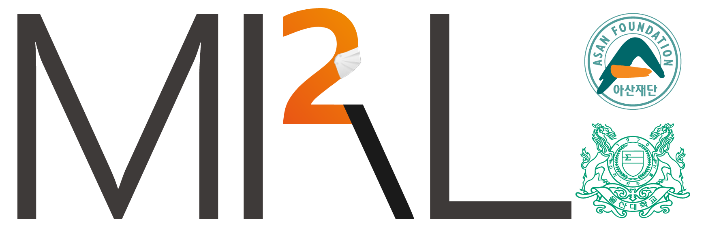

    

    

### Title: Basic and effective reproduction number of COVID-19 in South Korea without Sincheonji cases

**Abstract**

한국의 COVID-19 유행은 2020년 2,3월 동안 신천지 집단 감염 사태에 의한 "블랙 스완 효과"의 영향을 크게 받았으며, 최근 (3월 19일)은 신규 확진자 규모가 신천지 사태의 정점에 비해서는 상대적으로 줄어든 상태이다. 이러한 블랙 스완 효과는 사회적 거리 두기, 개한 연기, 손 씻기 및 마스크 착용 권장 등 현재의 감염 관리 정책이 적절한 지 여부를 판단하는 데에 혼란을 준다. 본 연구에서는 총 확진자 만이 아니라, 전체에서 신천지 관련 확진자를 제외한 데이터를 이용하여 기초감염재상산성(R0)와, 시간에 따른 유효재생산수(Rt)를 추정하였다. 신천지 또는 신천지 사태의 주 무대가 되었던 대구 경북 지역 사례를 제외한 나머지 확진자 수를 분석하면, R0는 1.0을 상회하고, Rt 역시 1.0 미만으로 억제되고 있다고 보기 어렵다. 신천지 사태와 같은 블랙 스완이 다시 나타나지 않는다 하더라도, 감염 확산 억제를 위한 노력을 현재수준 또는 그 이상으로 지속하지 않으면 COVID-19 유행 종식은 요원하다. 또한 지역별 시간에 따른 유효재생산수(Rt)를 실시간으로 확인하기 위한 홈페이지 (http://covid19.mi2rl.co)를 만들어서 지역별로 방역 강도를 조정할 때 도움이 될 수 있게 하였다.

medRxiv 논문 : https://www.medrxiv.org/content/10.1101/2020.03.19.20039347v

실시간 업데이트 싸이트 : http://covid19.mi2rl.co/

github 공개 싸이트: https://github.com/mi2rl/COVID-19_Rt/blob/master/README.md